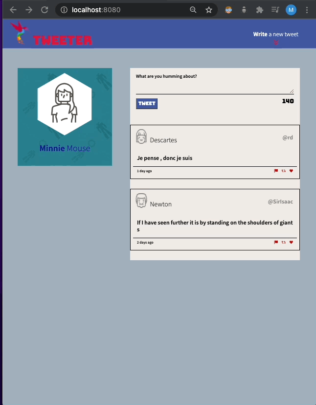
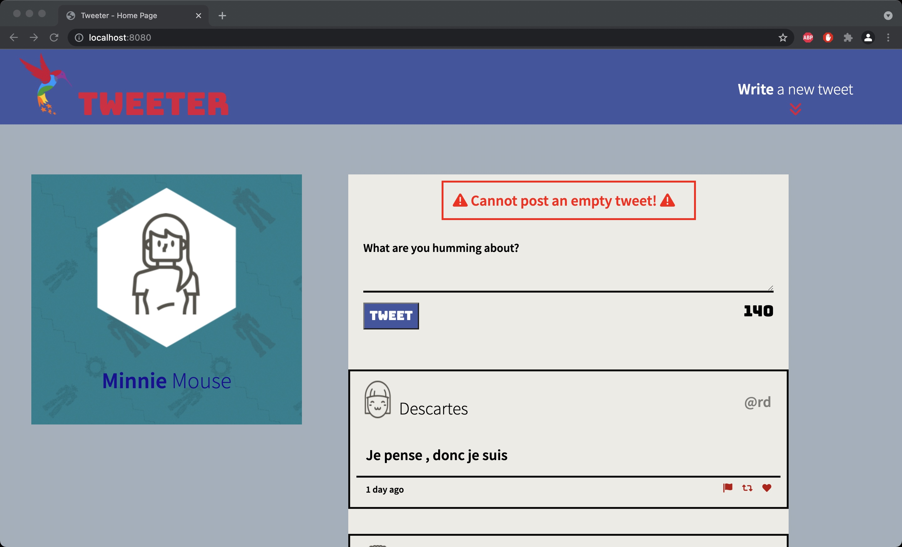
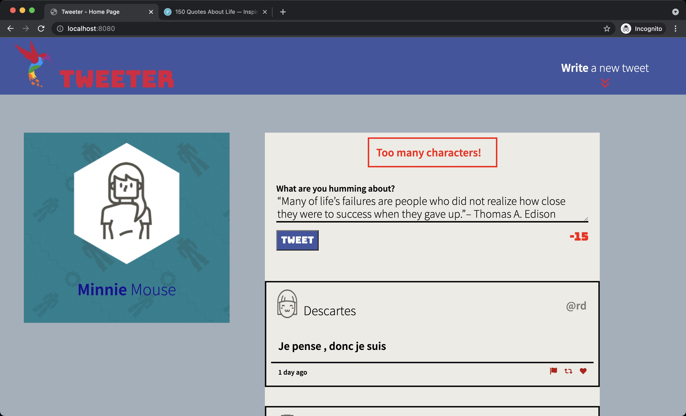
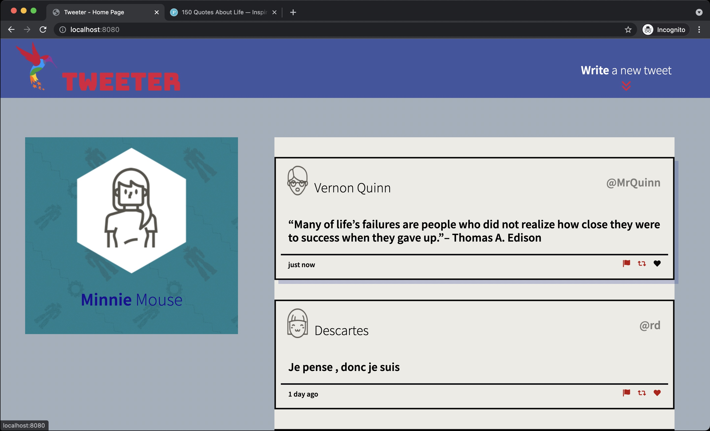
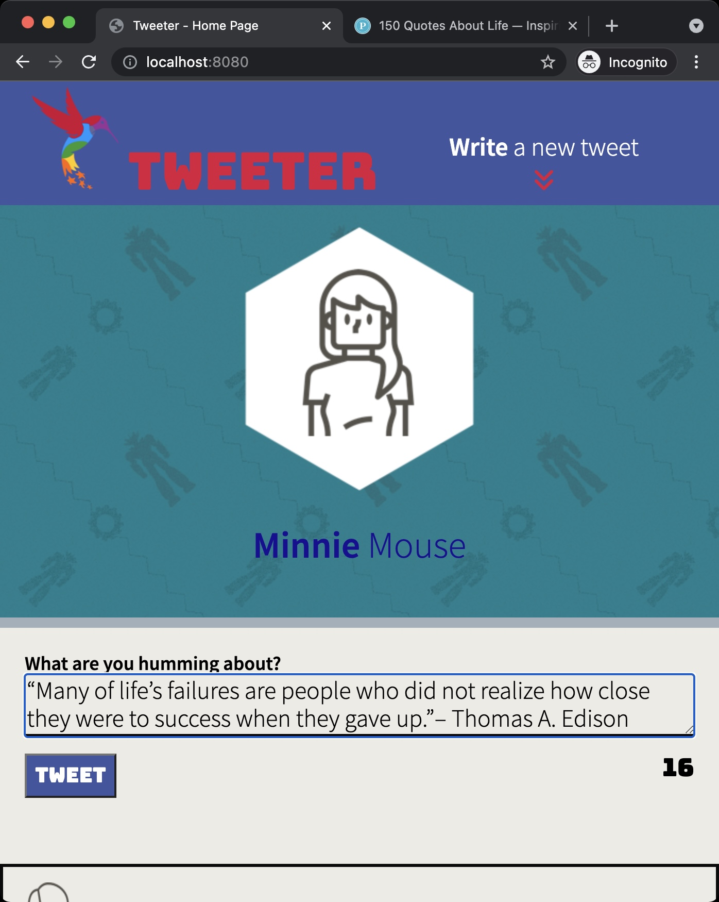

# Tweeter Project

Tweeter is a simple, single-page Twitter clone. This uses HTML, CSS, JS, jQuery and AJAX front-end skills, and their Node, Express back-end skills.

## Functionality Demonstration:

## It has the following features:

1. A new tweet form slides up and down when the arrow button in the top right corner is pressed.
2. Tweet form dynamically update a number of characters in entered text. By defualt the maximum number of chars is 140.
3. If a number of entered characters is not between 1 and 140 an error message will slide up when trying to submit a tweet.
4. After each tweet submission a new tweet will apper on top of existing tweets.
5. Web-site is responsive and will change layout if screen width is below treshold.

## Getting Started

1. Clone repo in your local folder: git clone https://github.com/github4maninder/tweeter.git tweeter
2. Switch into Tweeter directory. cd tweeter
3. Install dependencies using the `npm install` command.
3. Start the web server using the `npm run local` command. The app will be served at <http://localhost:8080/>.
4. Go to <http://localhost:8080/> in your browser.

## Dependencies

- Express
- Node 5.10.x or above
- body-parser
- Chance
